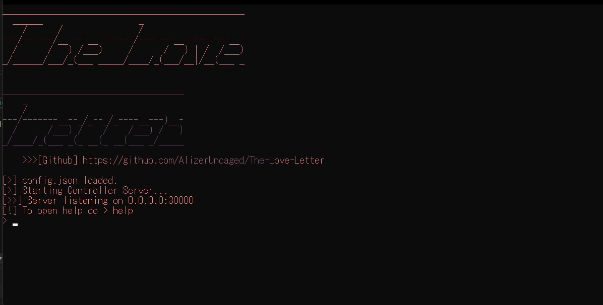

<div>
  
  <br>
  <h1>🕹️ Controller</h1>
  <p>"Who is in <span style="color:red">control</span>?"</p>
</div>
<br/>

## The Reverse Shell 🐚
The Love Letter [when enabled] spawns a reverse shell that opens a TCP port and listens for incoming cmd.exe commands from the server. The controller is written on .NET 5.0 and can run on any supported operating system 🖥️

# Mediums
The letter can be controlled by many mediums, all of which requires to run the console first.

## - 🐱‍💻 Console
The console program itself is the main controller for the shells and contains everything you need for managing the bots.

## - 🤖 Discord
The controller can be binded with a Discord bot, all you need is pass the token on the ```config.json``` file and the Discord bot will use Discord chat as shell, for multiple clients all you have to do is prefix the command with the index of the client, ex: ```0 shutdown /s```, the bot will be able to print the client index and their username and PC info every new instance.

For help just do ```l!help```.

## - ~~🌐 Panel~~
~~I'm not sure if I'm gonna add this, that would be a lot of work.~~


# ⚙️ Configuration ```config.json```

> - Interface ```Interface```

Which IP to listen to, for public IP you may use 0.0.0.0 or localhost.

> - Port ```Port```

The port where connection request from the letter will go to, default is 30000. This is the same port the letter listens for commands.

The interface and port can be changed during runtime on the [server's config.json](../Server/)

> - Is Discord Bot enabled? ```DiscordAPIEnabled```

Set to true if you want to enable binding via discord bot, set disabled if you don't.

> - Discord Bot Token ```DiscordAPIBotToken```

The token of the bot to use.

## Building
1. Install the **.NET 5.0 runtime**.
    - [Windows x64](https://dotnet.microsoft.com/download/dotnet/thank-you/runtime-5.0.7-windows-x64-installer)
    - [Linux x64](https://docs.microsoft.com/en-us/dotnet/core/install/linux)
    - [macOS x64](https://dotnet.microsoft.com/download/dotnet/thank-you/runtime-5.0.7-macos-x64-installer)
1. Build the program, more information on https://docs.microsoft.com/en-us/dotnet/core/tools/dotnet-build depending on your operating system, for Windows just load the .csproj file on VS 2019.
1. Run the program via ```dotnet Controller.dll```, for Windows just run the .exe file

Pretty simple right?

<p align="center">
 
</p> 