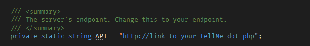



  
   
  <h1>The Love Letter</h1>
  
"Stalking is when two people go for a long romantic walk together but only one of them knows about it."

 

## What is The Love Letter?
An all-around tool for afk stalking ❤️ logs everything on the unfortunate person's computer from top to bottom while being as stealthy as possible, it contains the complete set of tools you need for stalking

Explore the source code 👇🏻
> [**The Letter's Contents (Features)**](Client/Armitage/README.md)

> [**PHP Loot**](Server/)

> [**Remote Shell Controller**](Controller/)

**For educational purposes only 🤷‍♀️** 
## Setup...
### Prerequisites
- Visual Studio 2019 or later
- Basic knowledge in C#
- At least 3 braincells
### Building
1. First you need a webserver upload [TellMe.php](Server/TellMe.php) there, copy the link
2. Change the API endpoint at [Server.cs](Client/Communication/Server.cs) pointing to [TellMe.php](Server/TellMe.php) on **your** server, put the link here

 

4. (Optional) Set up a Discord bot if you want the controller to work on Dicord, else you can just controll it via commandline, more info [here!](Controller/README.md)
5. Compile on Release, not on Debug
6. Star the repo (important 😉)

As simple as that.
# Contributions
This project is made during my free time, PRs are more than welcome 😄 I'd be more than happy if you star this repo! Motivates me to keep maintaining this 👍🏻
# License
The Love Letter is licensed under the MIT License

# Credits
Referenced Projects 

- [UACME](https://github.com/hfiref0x/UACME)
- [Critical Process](https://github.com/CnAoKip/CriticalProcess)
- [WMI Code Creator](https://www.microsoft.com/en-ph/download/details.aspx?id=8572)

# Final Words
This has been of great use to me during my time in highschool, I hope it may be of great use to you, too! 🥰 