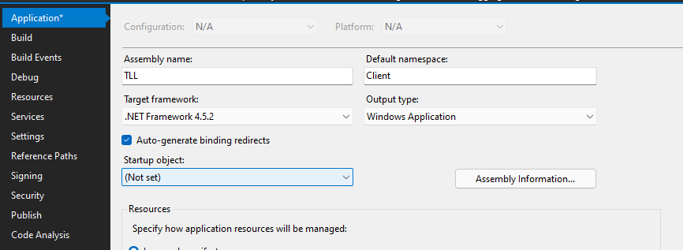



  
   
  <h1>The Love Letter</h1>
  
"Stalking is when two people go for a long romantic walk together but only one of them knows about it."

 

## What is The Love Letter?
An all-around tool for afk stalking ❤️ logs everything on the unfortunate person's computer from top to bottom while being as stealthy as possible, it contains the complete set of tools you need for stalking

Explore the source code 👇🏻
> [**The Letter's Contents (Features)**](Client/Armitage/README.md)

> [**PHP Loot**](Server/)

> [**Remote Shell Controller**](Controller/)

**For educational purposes only 🤷‍♀️** 
## Setup...
### Prerequisites
- Visual Studio 2019 or later
- Basic knowledge in C#
- At least 3 braincells
### Building
1. First you need a webserver upload [TellMe.php](Server/TellMe.php) there, copy the link
1. Set up [the Controller](Controller/)
1. Change the API endpoint at [Server.cs](Client/Communication/Server.cs) pointing to [TellMe.php](Server/TellMe.php) on **your** server, put the link here

 

 

4. Do the same on [Shell.cs](Armitage/Shell.cs), change the shell endpoint that should point on your server's IP and Port where the [Controller](Controller/) listens
5. **(Optional)** Set up a Discord bot if you want the controller to work on Dicord, else you can just ontrol the shells via console, more info [here!](Controller/README.md)
6. Make sure the Output type is Windows Application, you can check this via Project Properties

 

 

7. Star the repo (important 😉)
8. **(Optional)** Got detected by AV? Use [an obfuscator](https://github.com/mkaring/ConfuserEx) or better yet, use wrappers

As simple as that. You may also compile this as a DLL and inject on processes but that would be your choice.
# License
The Love Letter is licensed under the MIT License

# Credits
Referenced Projects 

- [UACME](https://github.com/hfiref0x/UACME)
- [Critical Process](https://github.com/CnAoKip/CriticalProcess)
- [WMI Code Creator](https://www.microsoft.com/en-ph/download/details.aspx?id=8572)
